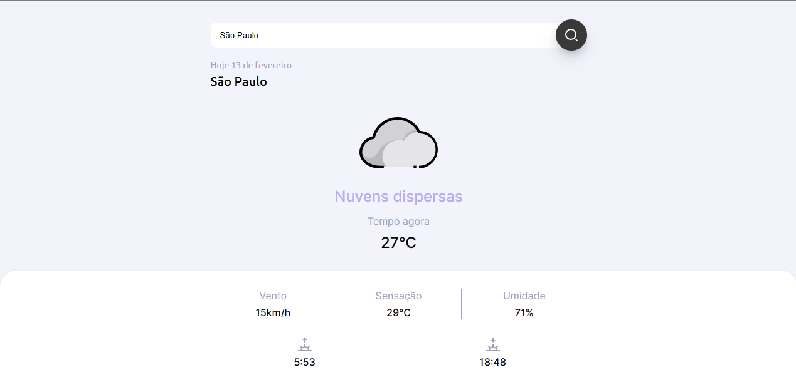

<h1 align="center">  Tempo Clima </h1>

Desenvolvi uma página com previsões do tempo e clima em tempo real.  

 

  

## 💻 Tecnologias

Esse projeto foi desenvolvido com as seguintes tecnologias:

- HTML e CSS
- JavaScript
- Git e Github

## 🔗 Projeto

Uma página web com previsões do tempo e clima em tempo real, aonde o usuário pode ter informações da sua localização atual ou de outro que desejar buscar, basta adicionar lugar específico na barra de pesquisa.

- [Visite o projeto online](https://dlucassilva.github.io/TempoClima/)

---

Projeto desenvolvido por [Lucas Silva](https://dlucassilva.github.io/DevLinks/)
